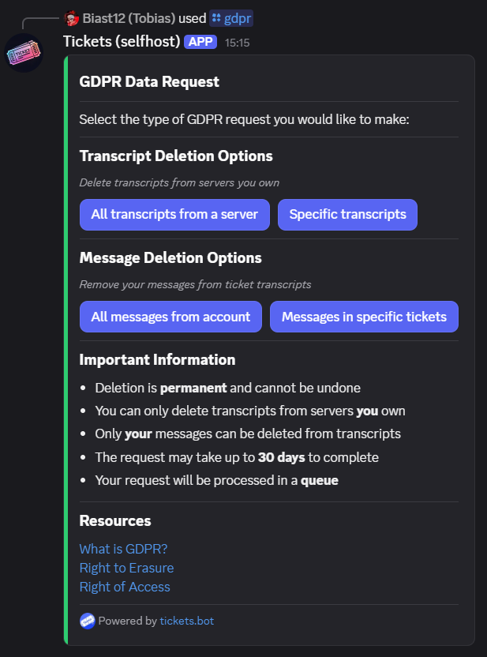
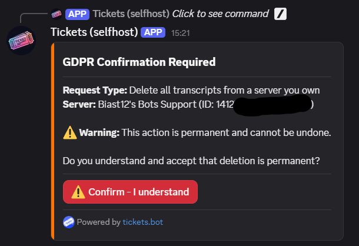
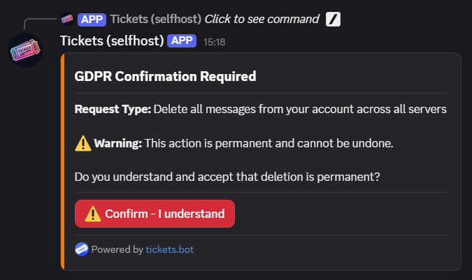
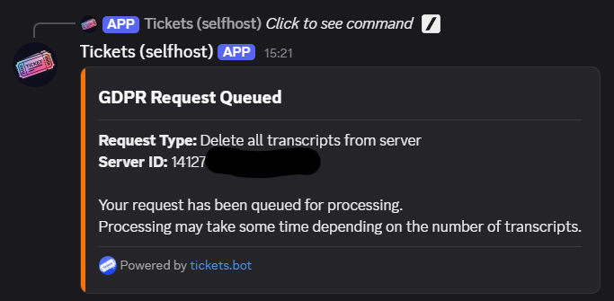
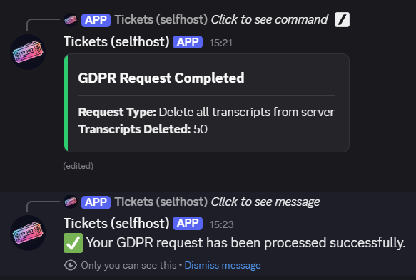

# GDPR Data Request

***
The `/gdpr` command allows users to exercise their data protection rights under the General Data Protection Regulation (GDPR). This command enables users to request deletion of ticket transcripts from servers they own, or anonymization of their messages from transcripts they participated in.

> **Note:** This command can **only be used in Direct Messages (DMs)** with the bot for privacy and security reasons.

**Important:** All GDPR deletions are **permanent and cannot be undone**. Requests are processed within 30 days.

## Overview

When you run the `/gdpr` command in your DMs with the bot, you'll see an interactive menu with different request types:

The command provides two main categories of requests:

### Transcript Deletion Options

*Delete transcripts from servers you own*

- **All transcripts from servers** - Deletes all ticket transcripts from one or more servers you own
- **Specific transcripts** - Deletes only specified ticket transcripts from a server you own

### Message Anonymization Options

*Anonymize your messages from ticket transcripts*

- **All your messages in servers** - Anonymizes your messages in transcripts from one or more selected servers where you participated
- **Your messages in specific tickets** - Anonymizes your messages only in specified ticket transcripts

## Language Support

The `/gdpr` command includes an optional `lang` parameter that allows you to select your preferred language for the GDPR request flow. This ensures all messages, confirmations, and completion notifications appear in your chosen language.

**Command:** `/gdpr lang:en-GB`

If no language is specified, the command defaults to English.

## Request Types

### All Transcripts from Servers

**What it does:** Permanently deletes all ticket transcripts from one or more selected servers.

**Requirements:**

- You must be the **owner** of the server(s)
- The server(s) must have existing transcripts

**Process:**

1. Click "All transcripts from servers"
2. Select one or more servers:
   - **If you own 25 or fewer servers:** Use the dropdown menu to select servers (multi-select enabled)
   - **If you own more than 25 servers:** Enter server IDs manually in the text field (comma-separated)
3. Review the confirmation screen showing which servers will be affected
4. Click "Confirm - I understand" to submit the request

> **Note:** Only servers you **own** with existing transcripts will appear in the dropdown menu.

### Specific Transcripts from a Server

**What it does:** Permanently deletes specific ticket transcripts from a server you own.

**Requirements:**

- You must be the **owner** of the server
- The server must have existing transcripts
- You must provide valid ticket IDs

**Process:**

1. Click "Specific transcripts"
2. Select the server:
   - **If you own 25 or fewer servers:** Use the dropdown menu to select one server
   - **If you own more than 25 servers:** Enter the server ID manually in the text field
3. Enter the ticket IDs you want deleted in the provided text field
4. Review the confirmation screen
5. Click "Confirm - I understand" to submit the request

> **Note:** Only servers you **own** with existing transcripts will appear in the dropdown menu.

**Ticket ID Format:**
You can use any of the following separators:

- Comma-separated: `1, 2, 5, 12`
- Semicolon-separated: `1; 2; 5; 12`
- One per line (newline-separated)
- Tab-separated

### All Your Messages in Servers

**What it does:** Anonymizes all your messages in transcripts from one or more selected servers where you participated.

**Requirements:**

- Must be requested from the same Discord account as the messages to be anonymized
- You must have participated in tickets in the selected server(s)

**Process:**

1. Click "All your messages in servers"
2. Select one or more servers:
   - **If you have messages in 25 or fewer servers:** Use the dropdown menu to select servers (multi-select enabled)
   - **If you have messages in more than 25 servers:** Enter server IDs manually in the text field (comma-separated)
3. Review the confirmation screen showing which servers will be affected
4. Click "Confirm - I understand" to submit the request

> **Note:** Only servers where you have **participated in tickets** with transcripts will appear in the dropdown menu. You do **not** need to be the server owner for this option.

**What happens to your messages:**

- Your username becomes "Removed for privacy"
- Message content is replaced with "[This message was removed in accordance with data protection regulations]"
- All embeds and attachments are removed
- Your user ID is anonymized

### Your Messages in Specific Tickets

**What it does:** Anonymizes your messages only in specified ticket transcripts from a server.

**Requirements:**

- You must have been a participant in the tickets
- You must provide a valid server ID
- You must provide valid ticket IDs

**Process:**

1. Click "Your messages in specific tickets"
2. Select the server:
   - **If you have messages in 25 or fewer servers:** Use the dropdown menu to select one server
   - **If you have messages in more than 25 servers:** Enter the server ID manually in the text field
3. Enter the ticket IDs you want your messages removed from in the provided text field
4. Review the confirmation screen
5. Click "Confirm - I understand" to submit the request

> **Note:** Only servers where you have **participated in tickets** with transcripts will appear in the dropdown menu. You do **not** need to be the server owner for this option.

**Ticket ID Format:**
You can use any of the following separators:

- Comma-separated: `1, 2, 5, 12`
- Semicolon-separated: `1; 2; 5; 12`
- One per line (newline-separated)
- Tab-separated

> **Tip:** To find a server ID, enable Developer Mode in Discord settings, then right-click the server icon and select "Copy Server ID". [More info](http://dis.gd/findmyid)

## Request Processing

After confirmation, your request is queued for processing:

### Processing Timeline

- Requests are queued immediately after confirmation
- Processing typically begins within a few hours
- Complete processing may take **up to 30 days** depending on the volume of data
- You'll receive a notification when processing is complete

### System Availability

The GDPR processing system runs on a separate worker service. If the system is temporarily unavailable, you'll see an error message:

**"The GDPR processing service is currently unavailable. Please try again later or contact support if this issue persists."**

This can happen during:
- Scheduled maintenance
- Service updates
- Temporary downtime

If you see this error, please try again in a few minutes. If the issue persists, contact support through the [support server](https://discord.gg/ticketsbot).

### Completion Notification

Once your request has been processed, you'll receive two notifications:

1. **Updated Message** - The original message is updated to show completion status
2. **Follow-up** - An ephemeral message (visible only to you) confirming processing status

The completion message shows:

- **For transcript deletions:** Number of transcripts deleted
- **For message anonymization:** Number of messages anonymized
- **If error occurred:** Error details and reason

## Important Information

### What Can and Cannot Be Deleted

**You CAN:**

- ✅ Delete transcripts from servers you own
- ✅ Anonymize your own messages from any transcript you participated in

**You CANNOT:**

- ❌ Delete transcripts from servers you don't own
- ❌ Anonymize or delete other users' messages (unless you own the server and delete the entire transcript)
- ❌ Recover deleted transcripts or anonymized messages
- ❌ Undo a GDPR request once it's been queued or processed
- ❌ Cancel a request after it has been submitted

### Permanence Warning

**⚠️ Warning:** All GDPR deletions and anonymizations are permanent and irreversible. Once data is deleted or anonymized, it cannot be recovered. Make absolutely sure you want to proceed before confirming any request.

### Request Queue

- Requests are processed in the order they are received
- You can have multiple pending requests
- Closing your DMs with the bot will **not** cancel your request
- Once a request is queued, there is **no way to cancel it**

## Frequently Asked Questions

**How long does processing take?**

Most requests are processed within a few minutes to a few hours, but GDPR regulations allow up to 30 days for completion. The processing time depends on the amount of data and the current queue length.

**Can I cancel a request after submitting it?**

No, once a request is queued, it cannot be cancelled. Please review carefully before confirming.

**Will I be notified if my request fails?**

Yes, you'll receive an ephemeral follow-up message and the original message will be updated explaining why the request failed.

**Can I select multiple servers at once?**

Yes! For "All transcripts from servers" and "All your messages in servers" options, you can select multiple servers using the multi-select dropdown menu (if you have 25 or fewer eligible servers) or by entering comma-separated server IDs (if you have more than 25).

**What's the difference between deleting transcripts and anonymizing messages?**

- **Deleting transcripts:** Completely removes the entire transcript file for all tickets. This requires server ownership.
- **Anonymizing messages:** Replaces your messages with anonymized text while keeping the transcript intact. This does not require server ownership.

**Can I request an export of my data before deletion?**

Currently, data export is not available through the bot. Please contact support via the support server for data export requests.

**Does message anonymization affect other users' ability to see the transcript?**

No, only your messages are anonymized. The transcript remains visible to others, but your messages and username will be replaced.

**What if I accidentally request deletion of the wrong data?**

Unfortunately, there is no undo function. Deleted data and anonymized messages cannot be recovered. Always double-check your request before confirming.

**What happens if the GDPR worker is offline?**

If the GDPR processing service is temporarily unavailable, you'll see an error message and won't be able to submit requests. Try again in a few minutes, or contact support if the issue persists.

**Do I need to stay in the support server or keep my DMs open?**

No, once your request is queued, it will continue processing even if you close your DMs or are offline. You'll receive the completion notification when you next open your DMs with the bot.

## Resources

Learn more about GDPR and your data protection rights:

- [What is GDPR?](https://gdpr.eu/what-is-gdpr/)
- [Right to Erasure](https://gdpr-info.eu/art-17-gdpr/)
- [Right of Access](https://gdpr-info.eu/art-15-gdpr/)

## Need Help?

If you have questions about GDPR requests or need assistance with data protection matters, please open a support ticket in the [Tickets Support Server](https://discord.gg/ticketsbot).
